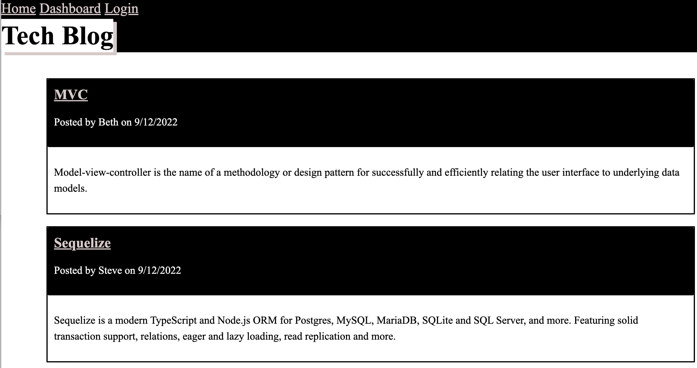

# tech-blog
 [](https://opensource.org/licenses/MIT)

  ## Description
  The tech-blog allows developeres to write about tech in the CMS-style blog site. The developer can publish articles, blog posts and comment their thoughts and opinions. 

  ## Table of Contents

  * [Description](#description)
  * [Installation](#installation)
  * [License](#license)
  * [Deployed-Website](#deployed-website)
  * [Questions](#questions)
  
  ## Installation

  To install this application you will need to run the following command:
  ```
   npm i
  ```
Applications used in this project were: 
* Node.js
* MySQL
* Express
* Sequelize
* Handlebars
  
  ## License
  This project is covered under the MIT license.

  ## Deployed-Website
  http://warm-gorge-78349.herokuapp.com


    Image of Tech-Blog Website
   

  ## Questions
  Please reach out to me at the below with any questions:
  
  * Email - mptheofield@gmail.com
  
  or visit my GitHub profile:
  
  * GitHub - [mtheofield](https://github.com/Mtheofield)